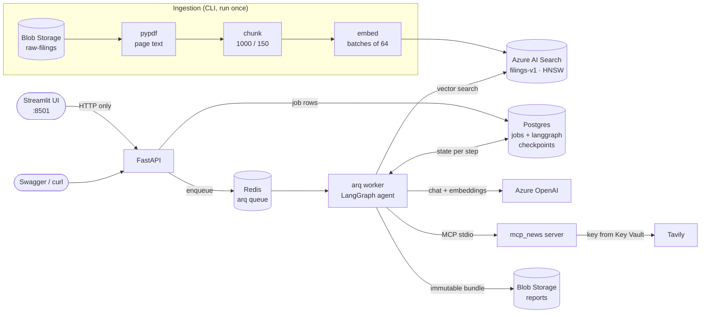
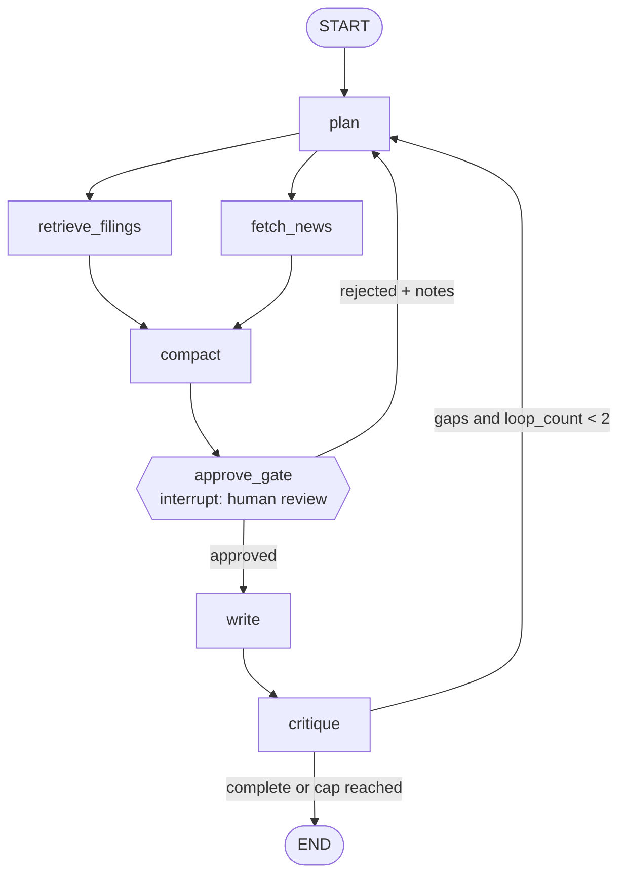

# Azure Market Intelligence Agent

Ask a research question about public companies and get back a structured
report where every claim cites a specific page of an SEC 10-K filing or a
news URL.

A FastAPI service queues the request, and a separate worker runs a
multi-step LangGraph agent. The agent plans sub-questions, then searches the
10-K filings (Azure AI Search) and live news (an MCP server) in parallel. It
condenses the evidence, **pauses for human approval**, writes a cited report,
and critiques it, re-planning once if it finds gaps. Every step is
checkpointed in Postgres, so a job survives a worker crash and resumes where
it stopped. Every finished report is archived, immutable, with its
provenance and approval history. A Streamlit client makes the whole flow
usable from a browser.

**Status:** Phase 2 (agents, MCP and resilience) plus the Day 12 Streamlit
client, over the FY2025/26 10-Ks of Amazon, Alphabet and Microsoft. Specs:
[Phase 1](docs/PHASE1_SPEC.md), [Phase 2](docs/PHASE2_SPEC.md),
[UI](docs/PHASE2_UI_SPEC.md).

## Architecture



### The agent graph



| Node | Does | If it fails |
|---|---|---|
| `plan` | 3–5 sub-questions, companies, whether news is needed (structured output) | job fails |
| `retrieve_filings` | vector search per sub-question (and per company), deduped | degrades: `data_gaps` |
| `fetch_news` | recent news via the MCP server, when the plan asks for it | degrades: `data_gaps` |
| `compact` | condenses evidence into a ~2K-token brief, keeping every reference id | job fails |
| `approve_gate` | pauses with the plan and evidence counts until someone resumes | waits |
| `write` | cited report from the brief and evidence | job fails |
| `critique` | LLM review plus deterministic citation checks; may send it back to `plan` | job fails |

Why this shape, why the gate sits before the writer, and why the loop is
capped at two passes: [ADR 0002](docs/adr/0002-graph-topology.md).

## Design choices

- **Keyless auth everywhere.** Every Azure client uses `DefaultAzureCredential`
  (Entra ID); the code holds no API keys. The only third-party key (Tavily)
  comes from Key Vault. Deployment names come from env vars, so swapping a
  retired model is a config change.
- **Citations grounded in Python, not trusted from the model.** The writer
  cites evidence by reference id only. Company, period, page and chunk are
  filled in from the evidence, and a reference that wasn't retrieved is
  dropped. The critic's deterministic checks override the LLM's verdict.
- **Human in the loop at the cheapest useful point.** The reviewer sees the
  plan and what was found before the expensive writing step, and can reject
  with notes to re-plan.
- **Hard cost cap.** At most two plan passes per job (`MAX_LOOPS`);
  rejections count toward it.
- **Durable and resumable.** Postgres checkpoints with `thread_id = job id`,
  plus startup recovery of jobs a dead worker left `running`.
  [ADR 0003](docs/adr/0003-checkpointing.md).
- **Degrade, don't fail.** A Search or news outage is recorded in the
  report's `data_gaps` and the run still completes. Transient errors (429, 5xx,
  timeouts) are retried with backoff. Chat calls fall back to a second
  deployment on repeated 429s or timeouts. LLM nodes have a wall-clock timeout.
- **An auditable record of every report.** On completion the worker writes
  `report.json`, `report.md`, `provenance.json` (evidence references, models
  and tokens per node) and one file per approval decision to
  `reports/{yyyy}/{mm}/{job_id}/`. Blobs are never overwritten.
  [ADR 0007](docs/adr/0007-report-archival.md).
- **Balanced retrieval for comparisons.** Each requested company gets its own
  top-k; otherwise "Google Cloud" chunks crowd out Amazon's "AWS" chunks.
- **A separate worker instead of FastAPI `BackgroundTasks`.**
  [ADR 0001](docs/adr/0001-async-job-execution.md).

## Setup

**Prerequisites:** [uv](https://docs.astral.sh/uv/), Docker, the Azure CLI,
and `az login` as a user with these roles on the resources:

| Resource | Role |
|---|---|
| Azure OpenAI / AI Foundry | Cognitive Services OpenAI User |
| Azure AI Search | Search Index Data Contributor, Search Service Contributor |
| Storage account | Storage Blob Data Contributor (reads filings; writes the report archive and ingestion manifest) |
| Key Vault | Key Vault Secrets User |

The OpenAI resource needs a chat deployment (e.g. `gpt-5-mini`) and an
embedding deployment (e.g. `text-embedding-3-small`). Key Vault needs a
`tavily-api-key` secret for news.

```bash
uv sync
cp .env.example .env    # then fill in your endpoints and deployment names
uv run scripts/smoke_test.py   # optional: checks every Azure dependency
```

## Ingest the filings

Upload 10-K PDFs to the `raw-filings` container, then:

```bash
uv run python -m ingestion.ingest --recreate
uv run python -m ingestion.verify "operating income growth"
```

Metadata comes from the filename (`{COMPANY} 10-K {YYYY-MM-DD}.pdf`) or, when
that doesn't match, from ticker aliases in the name and the filing's cover
page. Three 10-Ks give about 1,250 chunks and fit in AI Search's Free tier
(~50 MB).

## Run

```bash
docker compose up -d --build
docker compose ps          # api, worker, ui, postgres, redis
```

- **Web UI:** <http://localhost:8501> (see [Web UI](#web-ui-streamlit))
- **Swagger:** <http://localhost:8000/docs>

### Demo: submit, approve, get the report

```bash
JOB=$(curl -s -X POST localhost:8000/api/v1/research \
  -H 'content-type: application/json' \
  -d '{"query":"Compare Amazon and Microsoft cloud revenue growth and recent cloud news","companies":["Amazon","Microsoft"]}' \
  | python3 -c 'import json,sys; print(json.load(sys.stdin)["job_id"])')

# queued -> running (last_node / checkpoint_count show progress) -> awaiting_approval
until curl -s localhost:8000/api/v1/research/$JOB | grep -Eq '"status":"(awaiting_approval|completed|failed)"'; do sleep 3; done
curl -s localhost:8000/api/v1/research/$JOB | python3 -m json.tool   # "interrupt" holds the plan to review
```

The job waits at `awaiting_approval` until someone decides:

```json
"interrupt": {
  "pass": 1,
  "companies": ["Amazon", "Microsoft"],
  "sub_questions": ["Amazon AWS net sales and year-over-year growth ...", "..."],
  "needs_live_news": true,
  "evidence_counts": {"filings": 18, "news": 10},
  "degraded": []
}
```

```bash
# Reject with notes: the planner revises the plan and the job pauses again
curl -s -X POST localhost:8000/api/v1/research/$JOB/resume -H 'content-type: application/json' \
  -d '{"approved": false, "notes": "Use the latest fiscal year vs the prior year only."}'

# Approve: write -> critique (one more re-plan and approval if the critic finds gaps)
curl -s -X POST localhost:8000/api/v1/research/$JOB/resume -H 'content-type: application/json' \
  -d '{"approved": true}'

until curl -s localhost:8000/api/v1/research/$JOB | grep -Eq '"status":"(completed|failed)"'; do sleep 3; done
curl -s localhost:8000/api/v1/research/$JOB | python3 -m json.tool
```

Result (trimmed, from a real run):

```json
{
  "status": "completed",
  "last_node": "critique",
  "checkpoint_count": 12,
  "report": {
    "summary": "Amazon reported AWS net sales of $128,725 (FY2025) and $107,556 (FY2024); Amazon stated “AWS sales increased 20% in 2025.” Microsoft reported Intelligent Cloud revenue of $137,791 (FY2026) and $106,265 (FY2025) ...",
    "sections": [
      {
        "heading": "Amazon AWS — revenue and operating income (FY2024–FY2025)",
        "citations": [
          {
            "source_type": "filing", "reference": "amzn-annual-report-10k-145",
            "company": "Amazon", "doc_type": "10-K", "period": "2025-12-31",
            "source_blob": "amzn_annual_report_10k.pdf", "chunk_no": 145, "page": 25,
            "quote": "AWS sales increased 20% in 2025, compared to the prior year."
          }
        ]
      },
      {
        "heading": "Recent cloud-related developments after the fiscal-year ends",
        "citations": [
          {
            "source_type": "news", "company": "Microsoft", "period": "2026-09-23",
            "reference": "https://www.bradenton.com/news/business/article317353820.html",
            "quote": "Microsoft plans $10 billion-plus Gulf investment with focus on resilience"
          }
        ]
      }
    ],
    "data_gaps": []
  }
}
```

Job statuses: `queued`, `running`, `awaiting_approval`, `completed`,
`failed`. Resuming a job that isn't paused returns 409; an unknown id returns
404. `GET /health` checks Postgres and Redis.

### Demo: kill the worker mid-run, watch it resume

```bash
# Submit a job (as above), and once "last_node" is "plan" (retrieval in flight):
docker compose kill worker          # SIGKILL: no cleanup runs
docker compose up -d worker
docker compose logs -f worker
```

```
WARNING Recovering job 24dfc2b4-… (last node plan, 1 checkpoints): still queued; lock released
INFO    Job 24dfc2b4-… resuming from checkpoint; completed nodes are skipped, next=['retrieve_filings', 'fetch_news']
INFO    fetch_news: 10 new item(s)
INFO    retrieve_filings: 18 hit(s), 18 new, 18 total
INFO    Job 24dfc2b4-… awaiting approval (pass 1)
```

`plan` is not run again: the job resumes from its last checkpoint. On startup
the worker releases the dead worker's queue lock (otherwise held for 610s)
and re-enqueues every job still marked `running`.

### Local dev without app containers

```bash
docker compose up -d postgres redis
uv run uvicorn app.api.main:app --reload         # terminal 1
uv run arq app.jobs.worker.WorkerSettings        # terminal 2
API_BASE_URL=http://localhost:8000 uv run --group ui streamlit run ui/app.py   # terminal 3
uv run python -m app.graph.build "How did Amazon's operating income change in fiscal 2025?" --yes   # graph only (--yes auto-approves)
```

### Tests and checks

```bash
uv run pytest          # no network: SQLite, in-memory checkpointer, mocked LLM/Search/news/queue
uv run ruff check app ingestion mcp_news tests ui
uv run mypy app ingestion mcp_news tests --ignore-missing-imports
uv run --group ui mypy ui --ignore-missing-imports   # the UI is a separate program
```

## Web UI (Streamlit)

A thin client over the API, for demonstrating the approval gate and crash
resume and for reading reports. It is a demo harness, not a product. It talks
to the system **only over HTTP** (`ui/api_client.py`). It runs in its own
image containing just Streamlit and httpx, so it can't import the graph or
reach Postgres.

| Screen | Who | What |
|---|---|---|
| Submit | everyone | question (with example presets), optional company filter from the index |
| Jobs | everyone | recent jobs with status badges; for reviewers, jobs awaiting approval come first, flagged 🔔 |
| Job detail | everyone | status, elapsed time, current node, pass counter, degraded-source warnings; live progress (polls every 2s until the job settles) |
| ↳ tabs | everyone | **Report** (archived Markdown, data gaps up front, numbered citations, download), **Plan**, **Evidence** (filings + news, snippets as plain text), **Critique**, **Raw** JSON |
| ↳ approval | Reviewer, Admin | the plan, evidence counts and sub-questions; **Approve**, or **Reject** with required notes (sends it back to the planner). Analysts see "Awaiting reviewer approval." |
| Operations | Admin | index size, last ingestion (from the ingest CLI's manifest), job counts by status, running jobs; read-only |

**The role dropdown is a simulation, not access control.** "Simulated role
(dev only)" only changes what the UI shows. Anyone can pick any role, and the
API does not check roles: `POST /research/{id}/resume` is open to anyone who
can reach it. Day 15 replaces the dropdown with the app role from the user's
Entra ID token, enforced by the API. Until then, approval records store
`reviewer: null` rather than trusting the dropdown.

`Planner`, `Writer` and `Critic` are agent nodes in the graph, not human
roles. The job view shows what each produced, as tabs.

### Demo clips

Three short recordings belong in `docs/media/`:

1. **Happy path:** submit → progress → approval → approved → cited report.
2. **Crash resume:** `docker compose kill worker` mid-run, restart; the UI
   keeps showing progress and the job completes from its checkpoint.
3. **Rejection loop:** reject with notes, the planner re-runs, and the report
   follows the notes.

<!-- Uncomment once the clips are recorded:


-->

## Report archive

Each completed job writes `report.json`, `report.md` and `provenance.json`
to `reports/{yyyy}/{mm}/{job_id}/`, plus `approval-pass{n}.json` for every
decision. Uploads never overwrite an existing blob, and the prefix is stored
on the job (`archive_prefix`). `GET /api/v1/research/{id}/report.md` serves
the archived Markdown (header `X-Report-Source: archive`). If archiving
failed, it falls back to rendering from the job record (`rendered`). Why and
how: [ADR 0007](docs/adr/0007-report-archival.md).

## Configuration

Beyond the Azure endpoints in `.env.example`, all optional:

| Variable | Default | Purpose |
|---|---|---|
| `APPROVAL_REQUIRED` | `true` | `false` auto-approves every plan (no pause) |
| `AZURE_OPENAI_CHAT_FALLBACK_DEPLOYMENT` | unset | chat deployment used after repeated 429s or timeouts |
| `RETRY_ATTEMPTS` / `RETRY_BASE_WAIT_S` | `4` / `1.0` | retries for Search, embeddings and chat (429, 5xx, timeouts only) |
| `NODE_TIMEOUT_S` | `300` | wall-clock cap per graph node |
| `RETRIEVAL_TOP_K` | `4` | chunks per sub-question (per company for comparisons) |
| `NEWS_ENABLED` / `NEWS_MCP_URL` | `true` / unset | turn news off, or use a remote HTTP MCP server |
| `CHECKPOINT_SCHEMA` | `langgraph` | Postgres schema for LangGraph's checkpoint tables |
| `LANGGRAPH_STRICT_MSGPACK` | `true` | only safe types may be loaded from checkpoints |
| `REPORTS_CONTAINER` | `reports` | Blob container for the immutable report archive |
| `API_BASE_URL` (UI only) | `http://api:8000` | where the Streamlit client sends its requests |

## Live news via MCP

`mcp_news/` is a real [MCP](https://modelcontextprotocol.io) server (FastMCP)
wrapping Tavily. It exposes two tools:

- `search_company_news(company, days=7, max_results=5)`
- `get_market_context(topic)`

Both return `{title, url, published, snippet}`. The Tavily key is read from Key
Vault (`tavily-api-key`) with keyless auth and never leaves the server process.
Tavily calls retry timeouts, 429s and 5xx within the client's 30s per-call
budget.

The worker opens one MCP session at startup (`langchain-mcp-adapters`) and
keeps it for its lifetime. By default it spawns the server over **stdio**; set
`NEWS_MCP_URL` to use a separately deployed **streamable-HTTP** server instead
(`NEWS_MCP_TRANSPORT=streamable-http` on the server side). If the server is
unavailable, the run continues without news and the report's `data_gaps`
says so.

```bash
uv run python -m mcp_news.server                                          # stdio
npx @modelcontextprotocol/inspector uv run python -m mcp_news.server      # inspect interactively
```

**Untrusted content guardrail.** Everything fetched from the web is treated as
data, never as instructions:

1. The server strips HTML (including script and style blocks), unescapes
   entities, collapses whitespace, caps titles at 200 and snippets at 500
   characters, drops non-http(s) URLs and skips social platforms.
2. The graph's client sanitises again, because a remote server can't be
   trusted to have done it.
3. Prompts fence news text in `<untrusted_web_content>` tags, and the
   compact and write prompts say never to follow instructions found inside
   them.
4. The stdio server receives only the environment variables it needs for Key
   Vault access, not the database URL or anything else.
5. When rendered, quoted source text is escaped, and model-written prose has
   images, inline links and raw HTML neutralised (both `report.md` and the UI's
   Evidence tab, which shows snippets as plain text).

This is the start of the prompt-injection defence; Phase 4 completes it.

## Azure auth in containers (local only)

The `local` image target adds the Azure CLI. docker-compose mounts `~/.azure`
read-only and pins `AZURE_TOKEN_CREDENTIALS=AzureCliCredential`. On start, the
container copies the mount into a writable directory, because `az` rewrites
its token cache when it refreshes a token. Your host `~/.azure` is never
modified.

This is for local development only. The `runtime` target (no CLI) is what
gets deployed. **Phase 4 replaces this with a managed identity** by setting
`AZURE_TOKEN_CREDENTIALS=ManagedIdentityCredential`; no code changes.

## Project layout

```
app/
  config.py, azure_clients.py   settings; cached keyless clients (sync + async)
  resilience.py                 retries (429 / 5xx / timeouts)
  api/                          FastAPI app, routes (research, resume, report.md,
                                companies, ops status, health), schemas
  graph/                        state, nodes, prompts, LLM calls + fallback, retrieval,
                                MCP news client, Postgres checkpointer, graph assembly/CLI
  jobs/                         jobs table, store, arq worker + crash recovery
  reports/                      report Markdown renderer, immutable Blob archive
ingestion/                      index schema, PDF parse, chunk, ingest CLI, verify
mcp_news/                       MCP news server (FastMCP + Tavily) and sanitiser
ui/                             Streamlit client (app.py, api_client.py, Dockerfile)
tests/                          pytest: API, nodes, graph, worker, MCP, resilience, UI
docs/                           specs, ADRs 0001–0003 and 0007, media/ (demo clips)
Dockerfile, docker-compose.yml  runtime + local images; full local stack
```
