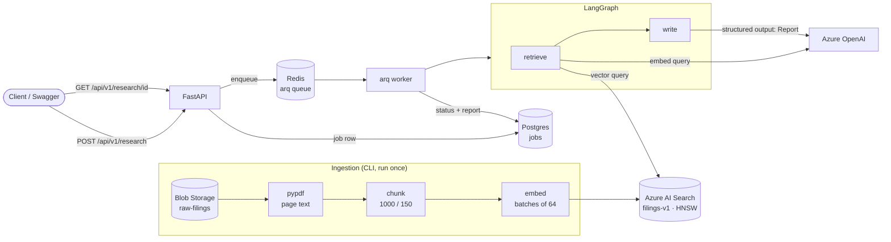

# Azure Market Intelligence Agent

Ask a research question about public companies and get back a structured
report where every claim cites a specific page of an SEC 10-K filing.

A FastAPI service queues the request, and an async worker runs a LangGraph
pipeline. The pipeline retrieves grounded context from Azure AI Search and asks
Azure OpenAI for a cited report. Answers come only from the filings: no web
search, no invented numbers. If the filings don't cover the question, the
report says so.

**Status:** Phase 1 (thin slice): an end-to-end RAG path over the FY2025/26
10-Ks of Amazon, Alphabet and Microsoft. See [the spec](docs/PHASE1_SPEC.md).

## Architecture



## Design choices

- **Keyless auth everywhere.** Every Azure client uses `DefaultAzureCredential`
  (Entra ID); the code holds no API keys. Deployment names come from env vars,
  so swapping a retired model is a config change.
- **Grounded, verifiable citations.** Each citation carries company, period,
  source file, chunk and page. After generation, any citation that doesn't
  point to a chunk that was actually retrieved is dropped.
- **Balanced retrieval for comparisons.** When several companies are
  requested, each gets its own top-k. A single top-k let "Google Cloud" chunks
  crowd out Amazon's "AWS" chunks.
- **A separate worker instead of FastAPI `BackgroundTasks`.** Jobs survive API
  restarts, and this sets up resumable runs in Phase 2. See
  [ADR 0001](docs/adr/0001-async-job-execution.md).
- **Pydantic v2 throughout:** settings, graph state, the `Report` schema
  (used directly as the LLM's structured output) and the API models.

## Setup

**Prerequisites:** [uv](https://docs.astral.sh/uv/), Docker, the Azure CLI,
and `az login` as a user with these roles on the resources:

| Resource | Role |
|---|---|
| Azure OpenAI / AI Foundry | Cognitive Services OpenAI User |
| Azure AI Search | Search Index Data Contributor, Search Service Contributor |
| Storage account | Storage Blob Data Reader |
| Key Vault | Key Vault Secrets User |

The OpenAI resource needs a chat deployment (e.g. `gpt-5-mini`) and an
embedding deployment (e.g. `text-embedding-3-small`).

```bash
uv sync
cp .env.example .env    # then fill in your endpoints and deployment names
uv run scripts/smoke_test.py   # optional: checks every Azure dependency
```

## Ingest the filings

Upload 10-K PDFs to the `raw-filings` container, then:

```bash
uv run python -m ingestion.ingest --recreate
uv run python -m ingestion.verify "operating income growth"
```

Metadata comes from the filename (`{COMPANY} 10-K {YYYY-MM-DD}.pdf`) or, when
that doesn't match, from ticker aliases in the name and the filing's cover
page. Three 10-Ks give about 1,250 chunks and fit in AI Search's Free tier
(~50 MB).

## Run

```bash
docker compose up -d --build
docker compose ps          # api, worker, postgres, redis: all healthy
```

Swagger UI: <http://localhost:8000/docs>

### Demo

```bash
JOB=$(curl -s -X POST localhost:8000/api/v1/research \
  -H 'content-type: application/json' \
  -d '{"query":"Compare Amazon and Alphabet cloud revenue growth","companies":["Amazon","Alphabet"]}' \
  | python3 -c 'import json,sys; print(json.load(sys.stdin)["job_id"])')

until curl -s localhost:8000/api/v1/research/$JOB | grep -Eq '"status":"(completed|failed)"'; do sleep 3; done
curl -s localhost:8000/api/v1/research/$JOB | python3 -m json.tool
```

Result (trimmed):

```json
{
  "status": "completed",
  "report": {
    "summary": "Amazon reported AWS sales increased 20% in 2025; Alphabet's Google Cloud revenues grew to $58,705 million in 2025 from $43,229 million in 2024 ...",
    "sections": [
      {
        "heading": "Amazon — AWS growth (reported)",
        "citations": [
          {
            "company": "Amazon", "doc_type": "10-K", "period": "2025-12-31",
            "source_blob": "amzn_annual_report_10k.pdf", "chunk_no": 145, "page": 25,
            "quote": "AWS sales increased 20% in 2025, compared to the prior year."
          }
        ]
      }
    ]
  }
}
```

Other endpoints: `GET /health` checks Postgres and Redis. An unknown job id
returns 404.

### Local dev without app containers

```bash
docker compose up -d postgres redis
uv run uvicorn app.api.main:app --reload         # terminal 1
uv run arq app.jobs.worker.WorkerSettings        # terminal 2
uv run python -m app.graph.build "How did Amazon's operating income change in fiscal 2025?"   # graph only
```

### Tests and checks

```bash
uv run pytest          # no network: SQLite + mocked LLM, Search and queue
uv run ruff check app ingestion tests && uv run mypy app ingestion tests --ignore-missing-imports
```

## Live news via MCP

`mcp_news/` is a real [MCP](https://modelcontextprotocol.io) server (FastMCP)
wrapping Tavily. It exposes two tools:

- `search_company_news(company, days=7, max_results=5)`
- `get_market_context(topic)`

Both return `{title, url, published, snippet}`. The Tavily key is read from Key
Vault (`tavily-api-key`) with keyless auth and never leaves the server process.

The worker opens one MCP session at startup (`langchain-mcp-adapters`) and
keeps it for its lifetime. By default it spawns the server over **stdio**; set
`NEWS_MCP_URL` to use a separately deployed **streamable-HTTP** server instead
(`NEWS_MCP_TRANSPORT=streamable-http` on the server side). If the server is
unavailable, the run continues without news and records `"news"` as a
degraded source.

```bash
uv run python -m mcp_news.server                                          # stdio
npx @modelcontextprotocol/inspector uv run python -m mcp_news.server      # inspect interactively
```

**Untrusted content guardrail.** Everything fetched from the web is treated as
data, never as instructions:

1. The server strips HTML (including script and style blocks), unescapes
   entities, collapses whitespace, caps titles at 200 and snippets at 500
   characters, drops non-http(s) URLs and skips social platforms.
2. The graph's client sanitises again, because a remote server can't be
   trusted to have done it.
3. Prompts fence news text in `<untrusted_web_content>` tags, and the
   compact and write prompts say never to follow instructions found inside
   them.
4. The stdio server receives only the environment variables it needs for Key
   Vault access, not the database URL or anything else.

This is the start of the prompt-injection defence; Phase 4 completes it.

## Azure auth in containers (local only)

The `local` image target adds the Azure CLI. docker-compose mounts `~/.azure`
read-only and pins `AZURE_TOKEN_CREDENTIALS=AzureCliCredential`. On start, the
container copies the mount into a writable directory, because `az` rewrites
its token cache when it refreshes a token. Your host `~/.azure` is never
modified.

This is for local development only. The `runtime` target (no CLI, about
355 MB) is what gets deployed. **Phase 4 replaces this with a managed
identity** by setting `AZURE_TOKEN_CREDENTIALS=ManagedIdentityCredential`;
no code changes.

## Project layout

```
app/
  config.py, azure_clients.py   settings; cached keyless clients (sync + async)
  api/                          FastAPI app, routes, schemas
  graph/                        state + Report, retrieval, nodes, compiled graph
  jobs/                         SQLAlchemy jobs table, store, arq worker
ingestion/                      index schema, PDF parse, chunk, ingest CLI, verify
mcp_news/                       MCP news server (FastMCP + Tavily) and sanitiser
tests/                          pytest (API, Report, worker)
docs/                           Phase 1 spec, ADRs
Dockerfile, docker-compose.yml  runtime + local images; full local stack
```
